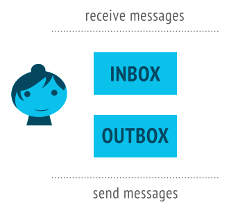

## ActivityPub

액티비티펍(ActivityPub) 프로토콜은 [ActivityStreams 2.0](<https://www.w3.org/TR/activitypub/#bib-ActivityStreams>)의 데이터 포맷을 이용한 탈 중앙화된 소셜 네트워킹 프로토콜 입니다. 컨텐츠에 대한 CRUD를 지원하는 클라이언트-서버 API를 제공하며, ‘연합’으로 이루어진 서버-서버 간의 알림과 컨텐츠 전달을 위한 API도 제공합니다.

### 1. Overview

액티비티펍은 2개의 레이어로 구성되어 있습니다:

- 서버와 서버 간의 연합 프로토콜 (이것을 이용하여 웹사이트간의 탈 중앙화된 정보 공유가 가능해집니다.)
- 클라이언트와 서버간의 프로토콜(이것을 이용하여 실제 세상의 유저, 봇, 그리고 다른 자동화된 프로세스들을 포함한 유저들이 각각의 계정과 서버를 가지고 기계의 제한 없이 액티비티펍을 이용하여 대화할 수 있습니다.)

액티비티펍 구현체는 이것들 중 하나 혹은 전부를 구현해야 합니다. 그러나 이 레이어 중 하나를 구현했다면, 나머지 하나를 구현하는 데에는 많은 노력이 들지 않습니다. 그리고 둘 다 구현하는 것으로 얻어지는 혜택은 들이는 노력에 비해 매우 큽니다. (당신의 웹사이트 중 일부가 탈 중앙화된  소셜 웹으로 동작하고, 다른 소셜 웹사이트에서 사용하는 클라이언트들을 당신의 웹사이트에서도 사용할 수 있습니다!)

액티비티펍에서 유저는 서버에 있는 사용자의 계정인 "액터(Actor)"로 대표됩니다. 다른 서버에 있는 사용자 계정은 또 다른 액터에 해당합니다. 각각의 액터는 다음과 같은 것들을 가지고 있습니다:

- 인박스(inbox): 액터가 세상으로부터 메세지를 받는 방법.
- 아웃박스(outbox): 액터가 세상으로 메세지를 보내는 방법.



이것들은 종단점이거나, 단지 액터 안에 액티비티스트림(ActivityStreams)으로 서술 된 리스트들에 불과합니다. (나중에 액티비티스트림에 대해 좀 더 이야기합니다.)

여기 우리의 친구 알리사의 기록을 통해 예제를 살펴보도록 합시다.

```json
{
    "@context": "https://www.w3.org/ns/activitystream",
    "type": "Person",
    "id": "https://social.example/alyssa/",
    "name": "Alyssa P. Hacker",
    "preferredUserName": "alyssa",
    "summary": "Lisp enthusiast hailing from MIT",
 	"inbox": "https://social.example/alyssa/inbox/",
 	"outbox": "https://social.example/alyssa/outbox/",
 	"followers": "https://social.example/alyssa/followers/",
 	"following": "https://social.example/alyssa/following/",
 	"liked": "https://social.example/alyssa/liked/"
}
```

액티비티펍은 [[액티비티스트림]](https://www.w3.org/TR/activitystreams-core/)을 어휘로 사용합니다. 이 액티비티스트림은 일반적으로 소셜 네트워크를 구성하는 데 통용되는 컨텐츠의 흐름을 나타내기에 적합합니다. 이렇게 액티비티스트림은 당신이 원하는 대부분의 것들을 지원하지만, 만약 원하는 게 없더라도 액티비티스트림은 [[JSON-LD]](https://www.w3.org/TR/json-ld/) 를 통해 내용을 확장할 수 있습니다. 이미 JSON-LD를 사용할 줄 안다면 JSON-LD에서 사용하는 연결된 데이터 접근 방식을 사용할 수 있습니다. 딱히 그렇지 않더라도 JSON-LD는 JSON을 알고 있다면 이해하기 어렵지 않습니다.

자, 이제 알리사는 그녀의 친구와 대화하고 싶어합니다. 그리고 그녀의 친구도 당연히 그렇겠죠! 다행이도 인박스와 아웃박스가 어떻게 해 줄 수 있을 것 같습니다. 그리고 둘 다 GET과 POST에 대해 다르게 동작합니다. 이것들이 어떻게 작동하는지 알아봅시다.


흠, 그러니까 설명하자면...

- 나는 메세지를 보내기 위해 수신자의 인박스에 POST 할 수 있습니다. (서버-서버 간)
- 나는 내 인박스로부터 최근 메세지를 가져오기 위해 GET 할 수 있습니다 (클라이언트-서버 간)
- 나는 누군가에게 메세지를 보내기 위해 내 아웃박스에 POST를 할 수 있습니다. (클라이언트-서버 간)
- 나는 누군가가 쓴 글을 읽기 위해 그 사람의 아웃박스에 GET을 할 수 있습니다. (클라이언트-서버 / 서버-서버 간)

당연하게도, 누군가가 쓴 글을 읽기 위해 일일히 그 사람의 아웃박스에 GET을 한다면, 이건 별로 효과적인 프로토콜이라고 부를 수 없겠죠! 당연하게도, 연합에서는 종종 액터에서 다른 서버의 액터가 가지고 있는 인박스로 메세지를 보내는 일이 자주 있습니다.

예제를 한번 들어보죠! 우리의 친구 알리사가 '벤'에게 연락을 하고 싶어하네요. 알리사는 벤에게 빌려줬던 책을 돌려받고 싶어합니다. 그녀의 액티비티스트림을 이용한 메세지를 구성하고 있는 요소들을 살펴보도록 하죠:

```json
{"@context": "https://www.w3.org/ns/activitystreams",
 "type": "Note",
 "to": ["https://chatty.example/ben/"],
 "attributedTo": "https://social.example/alyssa/",
 "content": "Say, did you finish reading that book I lent you?"}
```

이건 벤에게로 가야 할 쪽지입니다. 알리사는 이것을 그녀의 아웃박스로 POST 요청을 날립니다.


Since this is a non-activity object, the server recognizes that this is an object being newly created, and does the courtesy of wrapping it in a Create activity. (Activities sent around in ActivityPub generally follow the pattern of some activity by some actor being taken on some object. In this case the activity is a Create of a Note object, posted by a Person).

```json
{"@context": "https://www.w3.org/ns/activitystreams",
 "type": "Create",
 "id": "https://social.example/alyssa/posts/a29a6843-9feb-4c74-a7f7-081b9c9201d3",
 "to": ["https://chatty.example/ben/"],
 "actor": "https://social.example/alyssa/",
 "object": {"type": "Note",
            "id": "https://social.example/alyssa/posts/49e2d03d-b53a-4c4c-a95c-94a6abf45a19",
            "attributedTo": "https://social.example/alyssa/",
            "to": ["https://chatty.example/ben/"],
            "content": "Say, did you finish reading that book I lent you?"}}
```

Alyssa's server looks up Ben's ActivityStreams actor object, finds his inbox endpoint, and POSTs her object to his inbox.

​                

Technically these are two separate steps... one is client to server communication, and one is server to server communication (federation). But, since we're using them both in this example, we can abstractly         think of this as being a streamlined submission from outbox to inbox:

​                

Cool! A while later, Alyssa checks what new messages she's gotten. Her phone polls her inbox via GET, and amongst a bunch of cat videos posted by friends and photos of her nephew posted by her sister, she sees the following:

```json
{"@context": "https://www.w3.org/ns/activitystreams",
 "type": "Create",
 "id": "https://chatty.example/ben/p/51086",
 "to": ["https://social.example/alyssa/"],
 "actor": "https://chatty.example/ben/",
 "object": {"type": "Note",
            "id": "https://chatty.example/ben/p/51085",
            "attributedTo": "https://chatty.example/ben/",
            "to": ["https://social.example/alyssa/"],
            "inReplyTo": "https://social.example/alyssa/posts/49e2d03d-b53a-4c4c-a95c-94a6abf45a19",
            "content": "<p>Argh, yeah, sorry, I'll get it back to you tomorrow.</p>
                        <p>I was reviewing the section on register machines,
                           since it's been a while since I wrote one.</p>"}}
```

Alyssa is relieved, and likes Ben's post:

```json
{"@context": "https://www.w3.org/ns/activitystreams",
 "type": "Like",
 "id": "https://social.example/alyssa/posts/5312e10e-5110-42e5-a09b-934882b3ecec",
 "to": ["https://chatty.example/ben/"],
 "actor": "https://social.example/alyssa/",
 "object": "https://chatty.example/ben/p/51086"}
```

She POSTs this message to her outbox. (Since it's an activity, her server knows it doesn't need to wrap it in         a Create object). Feeling happy about things, she decides to post a public message to her followers. Soon the following message is blasted to all the members of her followers collection, and since it has the special Public group addressed, is generally readable by anyone.

```json
{"@context": "https://www.w3.org/ns/activitystreams",
 "type": "Create",
 "id": "https://social.example/alyssa/posts/9282e9cc-14d0-42b3-a758-d6aeca6c876b",
 "to": ["https://social.example/alyssa/followers/",
        "https://www.w3.org/ns/activitystreams#Public"],
 "actor": "https://social.example/alyssa/",
 "object": {"type": "Note",
            "id": "https://social.example/alyssa/posts/d18c55d4-8a63-4181-9745-4e6cf7938fa1",
            "attributedTo": "https://social.example/alyssa/",
            "to": ["https://social.example/alyssa/followers/",
                   "https://www.w3.org/ns/activitystreams#Public"],
            "content": "Lending books to friends is nice.  Getting them back is even nicer! :)"}}
```

#### 1.1 Social Web Working Group

[ActivityPub](https://www.w3.org/TR/activitypub/#Overview) is one of several related specifications being produced by the Social Web Working Group. Implementers interested in alternative approaches and complementary protocols should review [[Micropub](https://www.w3.org/TR/activitypub/#bib-Micropub)] and the overview document [[Social-Web-Protocols](https://www.w3.org/TR/activitypub/#bib-Social-Web-Protocols)].


### 2. Conformance

*todo*

